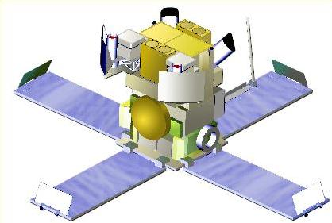

.. _gdt-hete2:

****************************************************
Welcome to HETE-2 Tools Documentation!
****************************************************

(Image from NASA/MIT)

The HETE-2 Gamma-ray Data Tools (GDT) is a toolkit for HETE-2 data built on the
:external:ref:`GDT Core Package<gdt-core>`.

The HETE-2 Satellite was launched on October 9, 2000 and operated until March 2008.
HETE-2 had three instruments: The gamma-ray instrument (FREGATE) sensitive in the 6--400keV
energy range, the Wide-field X-ray Monitor (WXM) sensitive in the 2--25keV energy range, and
the Soft X-ray Camera (SXC) sensitive in the 0.5--10keV energy range.

Currently the toolkit is limited to reading the publicly available lightcurve files from the
FREGATE instrument. Future versions may include decoding the raw telemetry files available
as 'ipp' files when more information describing the data format becomes available.

.. rubric:: Citing

If you use the HETE-2 Gamma-ray Data Tools in your research and publications,
we would definitely appreciate an appropriate acknowledgment and citation! We 
suggest the following BibTex:

::

 @misc{GDT-HETE2,
       author = {Adam Goldstein and William H. Cleveland and Daniel Kocevski},
       title = {HETE-2 Gamma-ray Data Tools: v1.0.0},
       year = 2024,
       url = {https://github.com/USRA-STI/gdt-hete2}
 }
 

.. rubric:: Acknowledgments

The creation of the Compton Gamma-ray Data Tools were funded by the NASA's
Astrophysics Data Analysis Program (ADAP) via grant number 80NSSC21K0651.

***************
Getting Started
***************
.. toctree::
   :maxdepth: 1

   install

******************
User Documentation
******************

HETE-2 Definitions
=================
.. toctree::
   :maxdepth: 1

   missions/hete2/time

FREGATE
=========

Instrument Definitions
----------------------

.. toctree::
   :maxdepth: 1

   missions/hete2/fregate/detectors

Data Types
----------

.. toctree::
   :maxdepth: 1

   missions/hete2/fregate/lightcurve

Data Finders and Catalogs
-------------------------

.. toctree::
   :maxdepth: 1

   missions/hete2/fregate/finders

----

*******
License
*******
.. toctree::
   :maxdepth: 1
   
   license

Indices and tables
==================

* :ref:`genindex`
* :ref:`modindex`
* :ref:`search`
