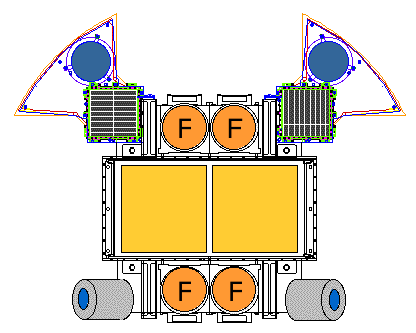

.. _fregate-detectors:
.. |FregateDetectors| replace:: :class:`~gdt.missions.hete2.fregate.detectors.FregateDetectors`
.. |Detectors| replace:: :class:`~gdt.core.detector.Detectors`

************************************************************************
Fregate Detector Definitions (:mod:`gdt.missions.hete2.fregate.detectors`)
************************************************************************
The |FregateDetectors| class contains the naming and orientation definitions of the
FREGATE detectors.

There are four FREGATE detectors ("A", "B", "C", and "D") that are aimed in the same
direction with two dectectors positioned on two sides of the Wide Field X-ray Monitor.
You can see the layout of the detectors below, the FREGATE detectors are the ones
marked with 'F' (image from MIT).

We can easily retrieve a detector definition by using standard "dot" notation:

    >>> from gdt.missions.hete2.fregate.detectors import FregateDetectors
    >>> FregateDetectors.A
    <FregateDetectors: A>

We can retrieve the string name of the detector:

    >>> FregateDetectors.C.name
    'C'

There is also a standard detector indexing scheme that is used for all FREGATE
detectors:

    >>> FregateDetectors.B.number
    1

Since the |FregateDetectors| class inherits from the |Detectors| base class, we
can also retrieve the pointing information of a FREGATE detector:

    >>> # detector azimuth, zenith
    >>> FregateDetectors.from_str('A').pointing()
    (<Quantity 0. deg>, <Quantity 180. deg>)
    
    >>> # detector elevation
    FregateDetectors.B.elevation
    <Quantity -90. deg>

We can also iterate over all FREGATE detectors:
    
    >>> # the list of detector names
    >>> print([det.name for det in FregateDetectors])
    ['A', 'B', 'C', 'D']

Reference/API
=============

.. automodapi:: gdt.missions.hete2.fregate.detectors
   :inherited-members:

