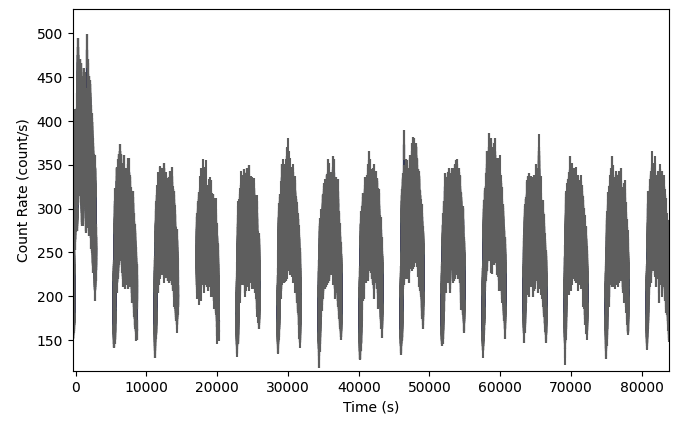

.. _fregate-lightcurve:
.. |FregateLightCurve| replace:: :class:`~gdt.missions.hete2.fregate.lightcurve.FregateLightCurve`
.. |FitsFileContextManager| replace:: :class:`~gdt.core.file.FitsFileContextManager`
.. |Phaii| replace:: :class:`~gdt.core.phaii.Phaii`
.. |TimeEnergyBins| replace:: :class:`~gdt.core.data_primitives.TimeEnergyBins`
.. |TimeBins| replace:: :class:`~gdt.core.data_primitives.TimeBins`
.. |Gti| replace:: :class:`~gdt.core.data_primitives.Gti`

************************************************************************
FregateLightCurve (:mod:`gdt.missions.hete2.fregate.lightcurve`)
************************************************************************

The |FregateLightCurve| class allows the user to load a FREGATE light curve
fits file from HEASARC and extract the |TimeBins|, |TimeEnergyBins|, |Phaii|,
and |Gti| data objects from it.

The FREGATE light curve file is a FITS file that has 1 primary extension, 4 detector data
extensions, and a GTI extension.

The 4 detector extensions contains counts in 4 energy ranges that overlap with each other.
Because of this, you must specify and energy band index (0 through 3) when extracting the
time bins, time energy bins, and PHA-II data from the file.

Examples
--------
First we will create a FregateLightCurve object using a sample file downloaded with gdt-data:

>>> from gdt.core import data_path
>>> lc_file = data_path / 'hete2-fregate' / 'GAMMA_sum_20020531.lc'
>>> lc_obj = FregateLightCurve.open(lc_file)

Now let's retrieve some basic information about the file.

The number of detectors in the file:

>>> lc_obj.num_dets
4

The detectors values in the file:

>>> lc_obj.detectors
[<FregateDetectors: A>,
 <FregateDetectors: B>,
 <FregateDetectors: C>,
 <FregateDetectors: D>]

The time zero value and GTI contained in the file:

>>> lc_obj.time_zero
706916972.2000004
>>> lc_obj.gti
<Gti: 22 intervals; range (-395.5169982910156, 83884.21875)>

Because the file has overlapping energy ranges that are incompatible with some analysis functions, you have
to specify both the detector you are interested in and the energy band index.

The energy band index has a range of 0 to 3 and the energy bounds can be found for each detector with:

>>> lc_obj.energy_bands('A')
array([[   8.,   40.],
       [   8.,   70.],
       [  32.,  400.],
       [ 400., 1000.]])

The above shows that 0 = 8 -- 40 keV, 1 = 8 -- 70 keV, 2 = 32 -- 400 keV and 3 = 400 -- 1000 keV

To retrieve the time bins for detector 'A' for the energy range of 8 -- 70keV:

>>> lc_obj.time_bin('A', 1)
<TimeBins: 73620 bins;
 range (-403.381, 83885.53);
 73620 contiguous segments>

The counts for each bin can be retrieved with:

>>> lc_obj.time_bins('A', 1).counts
array([250.2, 219.7, 265.5, ..., 256.3, 265.5, 253.3], dtype='>f4')

The time_energy_bin can be retrieved in a similar manner with:

>>> lc_obj.time_energy_bins('A', 1)
<TimeEnergyBins: 73620 time bins;
 time range (-403.381, 83885.53);
 73620 time segments;
 1 energy bins;
 energy range (8.0, 70.0);
 1 energy segments>

To retrieve a PHA II object and use it to plot a light curve do the following:

>>> import matplotlib.pyplot as plt
>>> from gdt.core.plot.lightcurve import Lightcurve
>>> pha = lc_file.phaii('A', 0)
>>> plot = Lightcurve(data=pha.to_lightcurve())
>>> plt.show()

Reference/API
=============

.. automodapi:: gdt.missions.hete2.fregate.lightcurve
   :inherited-members:

